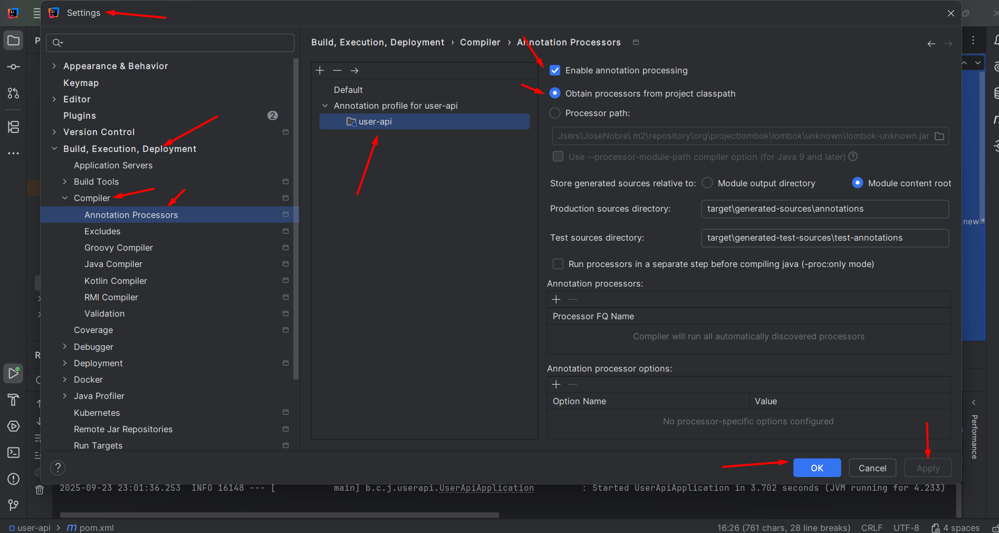

## Curso introdução a Microserviços

Sistema de Recursos humanos criando alguns microsserviços utilizando algumas tecnologias

* Java 11
* Spring
  * Spring Boot
  * Spring Data JPA
  * Spring Cloud
  * Eureka Server
  * API Gateway
  * Open Feign
  * Lombok
  * Tratamento de Exceções
  * H2 Database
* Docker
* Docker Compose
* 


No IntelliJ: vá em Settings > Build, Execution, Deployment > Compiler > Annotation Processors e ative para o módulo user-api.



____________________________________________________________________

# 🧩 HR System – Microsserviços com Docker, Eureka e API Gateway

Este repositório demonstra a execução de um sistema de microsserviços utilizando **Docker**, **Docker Compose**, **Eureka Server (Service Discovery)** e **API Gateway**.

As imagens Docker já estão publicadas no **Docker Hub**, portanto **não é necessário buildar o código-fonte** para executar o projeto.

🔗 **Docker Hub**: https://hub.docker.com/u/nobr3c  
🔗 **Exemplo de código-fonte**: https://github.com/jnobr3c/hr-system-user-api-course

---

## 📚 Sumário

- Arquitetura do Sistema
- Pré-requisitos
- Estrutura do Projeto
- Como Rodar o Projeto
- Acessos Importantes
- Logs
- Checklist de Validação
- Encerrando o Ambiente

---

## 🏗️ Arquitetura do Sistema

### 📐 Diagrama da Arquitetura

                  ┌──────────────────────┐
                  │        Cliente       │
                  │ (Browser / REST API) │
                  └───────────┬──────────┘
                              │
                              ▼
                   ┌────────────────────┐
                   │    API Gateway     │
                   │      (8765)        │
                   └───────────┬────────┘
                               │
           ┌───────────────────┼───────────────────┐
           │                   │                   │
           ▼                   ▼                   ▼
 ┌──────────────────┐ ┌──────────────────┐ ┌──────────────────┐
 │    User API      │ │  Payroll API     │ │  Outros serviços │
 │    (8000)        │ │    (8100)        │ │   (futuros)      │
 └─────────┬────────┘ └─────────┬────────┘
           │                    │
           └──────────┬─────────┘
                      ▼
             ┌────────────────────┐
             │   Eureka Server    │
             │      (8761)        │
             └────────────────────┘


---

### 🔍 Papel dos Componentes

| Serviço        | Descrição                                   |
|----------------|---------------------------------------------|
| Eureka Server  | Registro e descoberta de microsserviços     |
| API Gateway   | Porta de entrada da aplicação               |
| User API      | Gerenciamento de usuários                   |
| Payroll API   | Folha de pagamento                          |
| Docker Network| Comunicação interna entre containers        |

---

## ✅ Pré-requisitos

Certifique-se de ter instalado:

- **Docker**  
  https://docs.docker.com/get-docker/

- **Docker Compose**  
  (já incluso nas versões recentes do Docker)

### Verifique a instalação:
```
docker --version
docker compose version